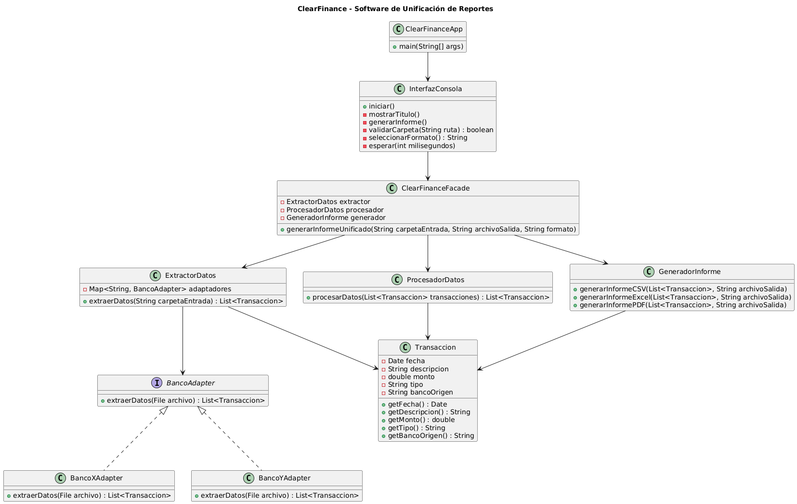

# Implementación del Patrón Facade

## 📖 Descripción del Patrón
El patrón **Facade** es utilizado para proporcionar una **interfaz simplificada y unificada** a un conjunto de interfaces en un sistema. Este patrón ayuda a reducir la **complejidad de la interacción** entre múltiples clases al exponer una única clase de acceso.

Este proyecto demuestra su implementación mediante un **software de unificación de reportes financieros** en Java, utilizando **Maven** como gestor de dependencias. **ClearFinance** permite extraer datos de múltiples reportes CSV, procesarlos y generar informes unificados en **CSV, Excel y PDF**.

---

## 💁‍♂️ **Estructura del Proyecto**
La estructura del proyecto sigue el estándar de Maven:

```
ClearFinance/
├── pom.xml                # Archivo de configuración de Maven
├── README.md              # Documentación del proyecto
└── src/
    ├── main/
    │   ├── java/
    │   │   └── com/
    │   │       └── andresazcona/
    │   │           ├── ClearFinanceApp.java
    │   │           ├── ClearFinanceFacade.java
    │   │           ├── InterfazConsola.java
    │   │           ├── adapters/
    │   │           │   ├── BancoAdapter.java
    │   │           │   ├── BancoXAdapter.java
    │   │           │   ├── BancoYAdapter.java
    │   │           ├── domain/
    │   │           │   ├── Transaccion.java
    │   │           ├── services/
    │   │           │   ├── ExtractorDatos.java
    │   │           │   ├── ProcesadorDatos.java
    │   │           │   ├── GeneradorInforme.java
    │   └── resources/
    │       ├── reportes/
    │       │   ├── BancoX_202310.csv
    │       │   ├── BancoY_202310.csv
    │       ├── salida/
    └── test/
        └── java/
            └── com/
                └── andresazcona/
                    ├── ExtractorDatosTest.java
                    ├── ProcesadorDatosTest.java
                    ├── GeneradorInformeTest.java
```

---

## 📌 **Dependencias Utilizadas**
Este proyecto utiliza las siguientes dependencias definidas en el archivo `pom.xml`:

```xml
<dependencies>
    <!-- Apache POI para manejo de archivos Excel -->
    <dependency>
        <groupId>org.apache.poi</groupId>
        <artifactId>poi-ooxml</artifactId>
        <version>5.2.3</version>
    </dependency>

    <!-- iText7 para generación de PDF -->
    <dependency>
        <groupId>com.itextpdf</groupId>
        <artifactId>kernel</artifactId>
        <version>7.1.16</version>
    </dependency>

    <dependency>
        <groupId>com.itextpdf</groupId>
        <artifactId>layout</artifactId>
        <version>7.1.16</version>
    </dependency>
</dependencies>
```

---

## ⚙️ **Instrucciones de Instalación**
### 1️⃣ **Clonar el repositorio:**
```sh
git clone https://github.com/andresazcona/Proyecto-1-Patrones-de-diseno-Facade.git
cd clearfinance
```

### 2️⃣ **Compilar el proyecto:**
```sh
mvn clean compile
```

### 3️⃣ **Ejecutar el programa:**
```sh
mvn exec:java -Dexec.mainClass="com.andresazcona.ClearFinanceApp"
```

---

## 📌 **Ejemplo de Ejecución**
Al ejecutar el programa, deberías ver la siguiente salida en consola:

```
============================================
  ClearFinance - Software de Unificación de Reportes
============================================

Ingrese la ruta de la carpeta con reportes de entrada (Enter para usar la ruta por defecto):
🔹 Usando ruta por defecto: src/main/resources/reportes

Ingrese la ruta de la carpeta donde se guardará el informe (Enter para usar la ruta por defecto):
🔹 Usando ruta por defecto: src/main/resources/salida

Ingrese el nombre del archivo de salida (sin extensión): informe

Seleccione el formato de salida:
1. CSV
2. Excel (.xlsx)
3. PDF
Opción: 3

✔ Generando informe...
✔ Archivos detectados: 2
   - Procesando: BancoX_202310.csv
   - Procesando: BancoY_202310.csv
✔ Total de transacciones unificadas: 50
✔ Informe PDF generado correctamente: src/main/resources/salida/informe.pdf
🌟 Informe generado exitosamente: src/main/resources/salida/informe.pdf
```

---

## 📌 **Diagrama UML**
El siguiente diagrama muestra la estructura del **Patrón Facade** en este proyecto:



---

## 📌 **Explicación de la Implementación**
El patrón **Facade** ha sido implementado utilizando las siguientes clases principales:

- **`ClearFinanceFacade`**: Coordina la extracción de datos, el procesamiento y la generación de informes.
- **`ExtractorDatos`**: Se encarga de leer los archivos CSV y extraer la información relevante de las transacciones.
- **`ProcesadorDatos`**: Ordena y filtra los datos extraídos, eliminando duplicados y asegurando su correcta estructuración.
- **`GeneradorInforme`**: Genera los informes en CSV, Excel y PDF, incluyendo un resumen financiero con ingresos, gastos y saldo final.
- **`InterfazConsola`**: Proporciona una interfaz de usuario en consola para que los usuarios ingresen las rutas y seleccionen el formato de salida.

---

## 👥 **Contribuciones**
Este proyecto fue desarrollado por:

- **Andrés Azcona**
- **Josue Sarmiento**
- **Juan David Gonzalez**

---

